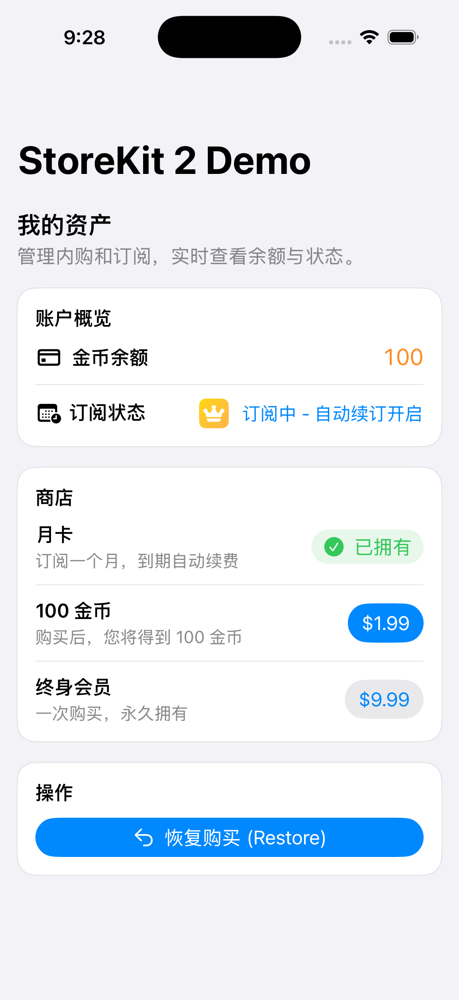

# StoreKitDemo

  
  
  
  

[Apple StoreKit 2 开发指南](https://juejin.cn/post/7577215663968190506) 文章的演示 Demo. 实际运行效果如下：

## 功能

- 读取 `.storekit` 中定义的商品并按价格排序展示
- 支持消耗型（金币）、非消耗型（终身版）与自动续订订阅（月度）
- 购买流程与交易验证（`Transaction.updates` 监听）
- 恢复购买与订阅状态检查，含自动续订状态文案
- 简单的 UI 展示资产：金币余额、订阅状态、是否为 Pro 用户

## 测试用商品 ID（与 `MyProducts.storekit` 对应）

- 非消耗型：`com.myapp.lifetime`
- 订阅：`com.myapp.pro.monthly`
- 消耗型：`com.myapp.coin.100`

## 目录

- `StoreKitManager.swift`：StoreKit 2 购买、验证、恢复逻辑
- `ContentView.swift`：SwiftUI 界面与交互
- `MyProducts.storekit`：本地 StoreKit 测试配置

## 如何测试？

1. 用 Xcode 打开 `StoreKitDemo.xcodeproj`，确保 `Edit scheme -> Run -> Options`，StoreKit Configuation 已经 配置了 `MyProducts.storekit`.
2. 运行 App: 目标平台选择 iOS/macOS，使用模拟器或真机均可。
3. 点击 "100 金币"：
   - 系统会弹出一个模拟的 Apple 支付弹窗。
   - 点击确认。
   - 你会看到上方金币余额变成 100。
4. 点击 "月卡 (订阅)"：
   - 购买成功后，按钮变成绿色对钩。
   - 上方状态变成 "订阅中 - 自动续订开启"。
5. 模拟退款/过期：
   - 回到 Xcode，点击 顶部菜单 `Debug -> StoreKit -> Manage Transactions`.
   - 你会看到刚才的订单。选中它，右键选择 Refund (退款) 或者 Expire (过期)。
   - 观察 App：虽然界面可能不会瞬间变（取决于刷新时机），但当你重启 App 或手动触发逻辑时，权益会消失。
   - 注意：Xcode 本地环境的 Transaction updates 有时候会有延迟，这是正常的。
6. 模拟恢复购买：
   - 删除 App 重装（模拟换手机）。
   - 启动 App，金币是 0（消耗品不恢复），但稍等片刻（`updateCustomerProductStatus` 运行后），月卡和终身会员会自动变回“已拥有”。

## 备注

- 示例未接入后台验单；真实业务请在服务器侧完成交易校验与发货防重。
